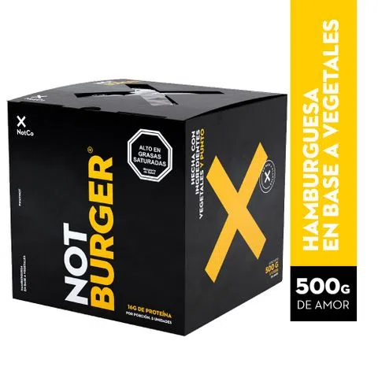

class:center, middle, .bg_karl
background-image: url(https://ychef.files.bbci.co.uk/1600x900/p02mnpsc.webp)
background-size: 1350px
background-position: 1% 20%

```{r setup, include=FALSE}
options(htmltools.dir.version = FALSE)
knitr::opts_chunk$set(
  fig.width=9, fig.height=3.5, fig.retina=3,
  out.width = "100%",
  cache = FALSE,
  echo = TRUE,
  message = FALSE, 
  warning = FALSE,
  hiline = TRUE
)
```

```{r xaringan-themer, include=FALSE, warning=FALSE}
library(xaringanthemer)
style_duo_accent(
  primary_color = "#1381B0",
  secondary_color = "#085e9f",
  inverse_header_color = "#FFFFFF"
)
```
```{css, echo = F}
.bg_karl {
  position: relative;
  z-index: 1;
  opacity: 0.2;
}
.bg_karl::before {    
      content: "";
      background-image: url('https://ychef.files.bbci.co.uk/1600x900/p02mnpsc.webp');
      background-size: cover;
      position: absolute;
      top: 0px;
      right: 0px;
      bottom: 0px;
      left: 0px;
      opacity: 0.1;
      z-index: -1;
}
```

# Mecanismos de persuasion

<br>
<br>
<br>
<br>
<br>
<br>

#### Francisco Villarroel (CICS- UDD) 
#### Curso Psicología Social - Universidad del Desarrollo


---
background-image: url(2_persuasion/2_persuasion_files/Logo-Psicologia-UDD.png)
background-size: 200px
background-position: 97% 97%

#Objetivo de la clase

- Comprender qué significa un cambio de actitud
- Reflexionar sobre los componentes éticos sobre los cambios de actitud
- Analizar principios claves sobre persuasión y cambio de actitud


---
class: inverse center middle

```{r, echo=FALSE, out.width="55%", fig.align='center'}


```
## ¿Vivimos en una distopía de manipulación mental?

--

Numerosa literatura (ficción, y otras no) han propuesto que vivimos en un gran mundo de manipulación mental y guerra psicológica. 

El elemento central de toda esta literatura es la persuasión y la influencia social en nuestro comportamiento individual.

¿Es real esta situación?

---
background-image: url(2_persuasion_files/Logo-Psicologia-UDD.png)
background-position: 97% 8%
background-size: 200px
class: center middle

## La verdad es más sutil, y con poderes menos espectaculares

---
background-image: url(2_persuasion_files/Logo-Psicologia-UDD.png)
background-size: 200px
background-position: 97% 97%
class: center, middle

# ¿Persuasión = Influencia ?


.pull-left[

## Persuasión

>_"Por persuasión se entiende cualquier cambio, intencionalmente buscado, que ocurre en las actitudes de las personas como consecuencia de su exposición a una propuesta persuasiva"_

Está abocada a contextos y actitudes específicas

]

.pull-right[

### Influencia

La influencia es un mecanismo más amplio, pues involucra

- Influencia interpersonal (tácticas de compromiso, reciprocidad, etc)
- Influencia grupal (Normalización, conformidad, desindividuación, pensamiento grupal)

]

---
background-image: url(2_persuasion_files/Logo-Psicologia-UDD.png)
background-size: 200px
background-position: 97% 97%
class: left, middle

## Persuasión y propaganda

--
#### La influencia es un mecanismo de cambio de actitud y comportamiento

--

#### Puede ser interpersonal, grupal u organizacional

--

#### La propaganda es unfluencia, pero a partir de los _mass media_

--

#### Permite conectar el medio social con el comportamiento individual

--

#### Propaganda es unidireccional e involucra el control de los canales de información

--

#### Propaganda es una connotación negativa a comunicación persuasiva que consideramos hostil


---
background-image: url(2_persuasion_files/Logo-Psicologia-UDD.png)
background-size: 200px
background-position: 97% 97%
class: left, top

## Persuasión y ética: ¿La persuación es buena o mala?

.pull-left[


#### La persuasión es intrínsecamente mala

- Basados en Platón y Kant (Idealistas)
- La persuación es inmoral pues manipula a las personas
- Las tratan como medios para fines

]


--

.pull-right[

#### La persuasión es intrínsecamente buena

- Las personas son libres de aceptar o rechazarla
- De todas formas sigue siendo mejor que la coerción directa

]

--

<br>
<br>
<br>

**Mirada ecléctica: no es ni bueno ni malo, sino más bien como una tecnología: depende de quien la use**


---
class: inverse center middle


## Mecanismos de persuasión

**Por Robert Cialdini**


---
background-image: url(2_persuasion_files/Logo-Psicologia-UDD.png)
background-size: 200px
background-position: 97% 97%
class: left, middle


.pull-left[

```{r, echo=FALSE,out.width="90%",fig.align='center', fig.cap="Robert Cialdini"}


```


]

.pull-right[

### Robert Cialdini

- Profesor Emérito de la Universidad Estatal de Arizona
- Especializado en psicologìa social
- Su trabajo fundamental está centrado en mecanismos de persuasión e influencia social 
- Su investigaciòn ha tenido alto impacto en marketing y en campañas políticas
- Fue contratato para la campaña de Obama (2012) y para el diseño de avisaje de Hillary Clinton (2016)

]

---
class: inverse center middle

# Siete mecanismos de persuasión según Cialdini

---
background-image: url(2_persuasion_files/Logo-Psicologia-UDD.png)
background-size: 200px
background-position: 97% 97%
class: left, middle

.pull-left[

### 1. Reciprocidad

-  Desde distintas disciplinas se ha comprobado que la reciprocidad (intercambio mútuo) tiene un enorme poder
-  La reciprocidad postula que, a partir de un favor inicial, _obligo_ a la otra persona a "devolver el favor" a partir de un favor de vuelta
-  Su limitación: favores pequeños se olvidan pronto

]

.pull-right[

>_“En general, los gestores de empresas han visto que, después de que se les ofrezca un regalo, los clientes están dispuestos a comprar productos y a aceptar peticiones que, de lo contrario, habrían rechazado”_

- **Ejemplos:**

1. Muestras gratis para que compren el producto
2. Venta de entradas o chocolates que se mezcla con el principio de contraste

]

---
background-image: url(2_persuasion_files/Logo-Psicologia-UDD.png)
background-size: 200px
background-position: 97% 97%

# Ejemplo:

.pull-left[

```{r, echo=FALSE, out.width="70%", fig.align='center', fig.cap="Campaña de spotify para captar suscriptores"}

knitr::include_graphics("2_persuasion_files/spotify.jpg")


```
]

.pull-right[

```{r, echo=FALSE, out.width="90%", fig.align='center', fig.cap="Campaña de Amazon Prime para captar suscriptores"}


```

]

---
background-image: url(2_persuasion_files/Logo-Psicologia-UDD.png)
background-size: 200px
background-position: 97% 97%


.pull-left[
                                                                                                                              ### 2. Simpatía

- Las personas tienden a mostrar conformidad cuando quien emite el mensaje es simpático
- Los factores que profundizan esa simpatía son múltiples:

1. Belleza física
2. Semejanza (que la persona que emita el mensaje "sea como yo")
3. Familiaridad por contacto reiterado con esa persona
4. Ser asociados a cuestiones positivas
5. Amistad estratégica


]

.pull-right[


]

---
background-image: url(2_persuasion_files/Logo-Psicologia-UDD.png)
background-size: 200px
background-position: 97% 97%

# Ejemplo:


.pull-left[

```{r, echo=FALSE, out.width="70%", fig.align='center'}


```

]

.pull-right[
```{r, echo=FALSE, out.width="100%", fig.align='center'}

```

]


---
background-image: url(2_persuasion_files/Logo-Psicologia-UDD.png)
background-size: 200px
background-position: 97% 97%
class: left, middle

.pull-left[

>_"El principio de aprobación social puede utilizarse para estimular la conformidad de una persona ante una petición informándole de que muchos otros individuos (cuantos más, mejor), muestran o han mostrado su conformidad"_

]

.pull-right[

### 3. Aprobación Social 

1. Para tomar decisiones, un elemento fundamental que usan las personas es ver qué es lo que creen los demás o cómo actúan
2. La aprobación social es un mecanismo de persuación que se necesitan 3 componentes:
- Funciona cuando hay condiciones de incertidumbre para tomar una decisión
- Personas tienden a imitar a otros. Nos Parece más correcta, más viable y socialmente más aceptable.
- Principio de persuación de los semejantes

]
---
background-image: url(2_persuasion_files/Logo-Psicologia-UDD.png)
background-size: 200px
background-position: 97% 97%

# Ejemplo:


```{r, echo=FALSE, out.width="70%", fig.align='center'}

knitr::include_graphics("2_persuasion_files/aprobación social.png")

```
---
background-image: url(2_persuasion_files/Logo-Psicologia-UDD.png)
background-size: 200px
background-position: 97% 97%

# Pero también..


```{r, echo=FALSE, out.width="70%", fig.align='center'}


```


---
background-image: url(2_persuasion_files/Logo-Psicologia-UDD.png)
background-size: 200px
background-position: 97% 97%
class: left, middle

.pull-left[

### 4. Autoridad

- Las figuras de autoridad pueden causar altas presiones de persuasión, incluso para cuestiones que las personas no aceptaŕian en otros contestos
- Está basada en prácticas de socialización diseñadas para decir que la obediencia es la conducta correcta
- Cuando se obedece, principalmente es a partir de ciertos símbolos
  1. Ropa
  2. Títulos (académicos, nobleza, etc)
  3. Elementos de status como automóviles
  
]

.pull-right[

- Quienes más obedecen tienden a infravalorar la presión de la autoridad en su propio comportamiento
- Obstáculo: La autoridad puede ser por posición social o expertice. Los primeros pueden generar más rechazo, los segundos no. 
- ¿Qué tan fiable es un experto?


]
---
background-image: url(2_persuasion_files/Logo-Psicologia-UDD.png)
background-size: 200px
background-position: 97% 97%

## Ejemplo - La llegada de Ikea a Chile

```{r, echo=FALSE, out.width="70%", fig.align='center', fig.cap="Portada de la página de Ikea: Apelas a la autoridad por trayectoria"}


```


---
background-image: url(2_persuasion_files/Logo-Psicologia-UDD.png)
background-size: 200px
background-position: 97% 97%
class: left, middle

.pull-left[

### 6. Escasez

- Técnica de persuación basada en el principio en que atribuímos más valor a las oportunidades menos accesibles.
- "Si no actúas ya, pierdes algo valioso"
- Principio de aversión a la pérdida: nos mueve más la posibilidad de perder algo que la de ganar otra cosa de igual valor
- Este mecanismo se sustenta por:
  1. La poca accesibilidad lo usamos como indicador de calidad
  2. No aprovechar la posibilidad quita libertad, según la teoría de la reactancia psicológica
  

]

.pull-right[
- Principios funcionan cuando:
  1. La escasez es reciente
  2. Cuando se compite con otros para lograrlo


Ejemplos:

1. "Series limitadas" de productos
2. "Fechas límite" para compras o suscripciones. 


]

---
background-image: url(2_persuasion_files/Logo-Psicologia-UDD.png)
background-size: 200px
background-position: 97% 97%

# Ejemplo:

```{r, echo=FALSE, out.width="90%", fig.align='center', fig.cap="Oferta 'limitada' en la página de inicio de PCFactory"}


```

---
background-image: url(2_persuasion_files/Logo-Psicologia-UDD.png)
background-size: 200px
background-position: 97% 97%
class: left, top

.pull-left[

#### Valor del compromiso
1. Conseguir un compromiso sirve para que acciones futuras sean coherentes con él
2. Los compromisos son más efectivos cuando son públicos
3. Un compromiso fuerte condicionay modifica comportamiento a largo plazo


]

.pull-right[

### 7. Compromiso y coherencia

- Las personas buscan parecer coherentes:
  1. Es valorada por la sociedad
  2. Imagen pública
  3. Nos da atajos para vivir en una vida llena de estímulos


**Ejemplo**: Reservas de mesas

]

---
background-image: url(2_persuasion_files/Logo-Psicologia-UDD.png)
background-size: 200px
background-position: 97% 97%

# Ejemplo:


```{r, echo=FALSE, out.width="35%", fig.align='center'}


```


---
background-image: url(2_persuasion_files/Logo-Psicologia-UDD.png)
background-size: 200px
background-position: 97% 97%
class: left, middle

.pull-left[

### 8. Unidad

- Las personas entregan confianza a quienes consideramos "es uno más de nosotros"
- Pueden ser étnico, religioso, político, familiar, nacionalidad
- La Unidad grupal:
  1. Favorece resultados y bienestar intergrupal por sobre el extragrupal
  2. Elevan solidaridad grupal y se usan los comportamientos de otros como guías
  3. Ayudar a los otros es ayudarse a sí mismos
- También la identidad se crea en el hacer cosas en conjunto

]

.pull-right[

### Obstáculos

- Dura por poco tiempo: es necesario hacerlo repetidas veces para que sea duradero
- Debe ir aumentando la importancia percibida


]

---
background-image: url(2_persuasion_files/Logo-Psicologia-UDD.png)
background-size: 200px
background-position: 97% 97%

# Ejemplo - Club Lìder

```{r, echo=FALSE, out.width="65%", fig.align='center'}


```

```{r, echo=FALSE, out.width="65%", fig.align='center'}


```


---
background-image: url(2_persuasion_files/Logo-Psicologia-UDD.png)
background-size: 200px
background-position: 97% 8%


#Un ejemplo para cerrar

.pull-left[


```{r, echo=FALSE, out.width="90%", fig.align='center'}



```


]

.pull-right[

Principio               | Estrategia 
------------------------|------------
Reciprocidad            | Regalo muestras gratis del producto    
Autoridad               | Científico muestra cómo el producto es + ecológico y saludable     
Simpatía                | Utilizo gente vegana con carisma y conocidos en mi campaña     
Aprobación social       | Hago ranking de productos mejor evaluados por la gente  
Escasez                 | Ofertas especiales en cantidades limitadas
Compromiso y coherencia | Hacer compromisos públicos sobre no comer más animales     
Unidad                  | Comida y beneficios para veganos    

]


---
class: inversed, center, middle
background-image: url(https://user-images.githubusercontent.com/163582/45438104-ea200600-b67b-11e8-80fa-d9f2a99a03b0.png)
background-size: 80px
background-position: 50% 90%

# ¡Gracias!


fvillarroelr@udd.cl

Slide creado con el paquete [**xaringan**](https://github.com/yihui/xaringan).


El  chakra viene de [remark.js](https://remarkjs.com), [**knitr**](https://yihui.org/knitr/), y [R Markdown](https://rmarkdown.rstudio.com).
Este slide fue creado por [**xaringan**](https://github.com/yihui/xaringan) y [**XaringanThemer**](https://pkg.garrickadenbuie.com/xaringanthemer/index.html)


