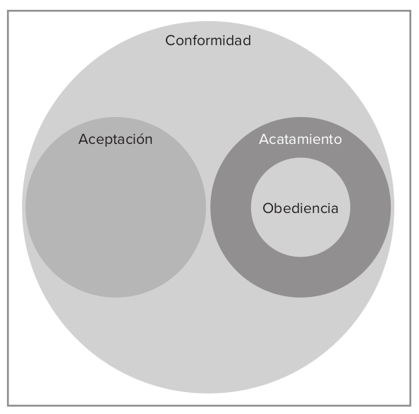
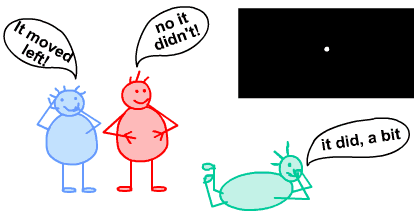
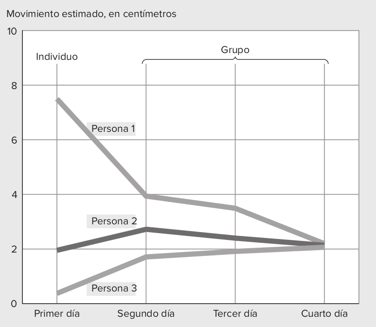
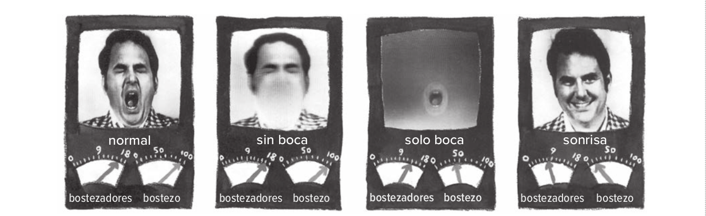
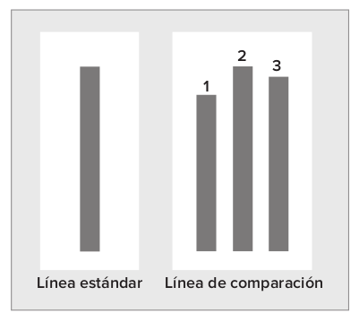
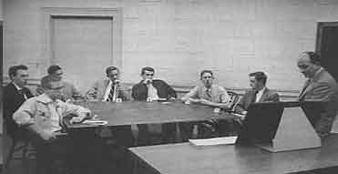
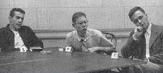
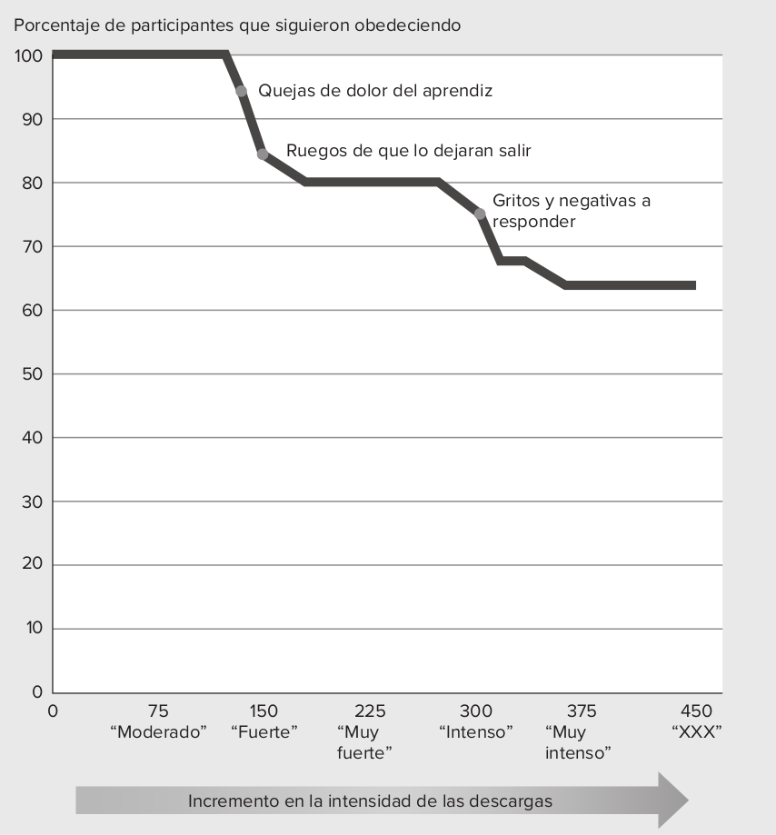

class:center, middle, bg_karl
background-position: 1% 20%

```{r setup, include=FALSE}
options(htmltools.dir.version = FALSE)
knitr::opts_chunk$set(
  fig.width=9, fig.height=3.5, fig.retina=3,
  out.width = "100%",
  cache = FALSE,
  echo = TRUE,
  message = FALSE, 
  warning = FALSE,
  hiline = TRUE
)
```

```{r xaringan-themer, include=FALSE, warning=FALSE}
library(xaringanthemer)
style_duo_accent(
  primary_color = "#1381B0",
  secondary_color = "#085e9f",
  inverse_header_color = "#FFFFFF"
)
```

```{css, echo = F}
.bg_karl {
  position: relative;
  z-index: 1;
}
.bg_karl::before {    
      content: "";
      background-image: url('https://ethicsunwrapped.utexas.edu/wp-content/uploads/2017/02/Obedience-to-Authority-1.jpg');
      background-size: cover;
      position: absolute;
      top: 0px;
      right: 0px;
      bottom: 0px;
      left: 0px;
      opacity: 0.35;
      z-index: -1;
}

.my-style {
  font-weight: bold;
  font-style: normal;
  font-size: 1em;
  color: white;
}
```


# Obediencia y conformidad

<br>
<br>
<br>
<br>
<br>
<br>
<br>
<br>
<br>
<br>

#### Francisco Villarroel Riquelme (CICS- UDD)
#### Curso Psicología Social - Universidad del Desarrollo


```{r, echo=FALSE, fig.align='center', out.width="20%"}


knitr::include_graphics("3_obediencia_files/logo_psicologia_UDD.png")
```

---
background-image: url(3_obediencia_files/logo_psicologia_UDD.png)
background-size: 200px
background-position: 97% 97%

#Objetivo de la clase

- Comprender las diferencias entre conformidad y obediencia
- Analizar cuáles son los expertimentos clásicos sobre conformidad y obediencia
- Analizar los factores predictores de obediencia y conformidad
- Distinguir los factores principales para analizar quienes son los que se conforman u obedecen más
---
class:center, middle, bg_karl
background-image: url(https://img2.rtve.es/imagenes/documentos-rne-juicio-adolf-eichmann-ejecutor-del-holocausto-18-02-22/1645217295119.jpg)
background-size: 1350px
background-position: 1% 20%
class: center middle

<br>
<br>
<br>
<br>
<br>
<br>
<br>

# Cuando se cometen atrocidades como el holocausto ¿sólo se siguen órdenes?

<br>
<br>
<br>
<br>


_Juicio a Adolf Eichmann, Ejecutor del Holocausto (1961)_

---
background-image: url(3_obediencia/3_obediencia_files/logo_psicologia_UDD.png)
background-size: 200px
background-position: 97% 97%
class: left, middle

## ¿Qué es la conformidad?

--

.pull-left[

>_"La conformidad es el término general que se refiere a actuar de manera diferente debido a la influencia de otros. La conformidad no es solo actuar como los demás; también es verse afectado por cómo actúan"_

]

.pull-right[

- La conformidad es un cambio de comportamiento para unirse a un "otro"
- En occidente es visto de mala forma, pero en oriente es un valor más bien positivo.

]


---
background-image: url(3_obediencia_files/logo_psicologia_UDD.png)
background-size: 200px
background-position: 97% 97%
class: left, middle

## Conformidad, aceptación, acatamiento y obediencia

.pull-left[

**Aceptación**: Cuando un grupo lo ha persuadido de algo. Cree de manera sincera que es la acción correcta

**Acatamiento**: El Acatamiento es conformarse con una expectativa o petición sin creer lo que estás haciendo. 

**Obediencia**: Variación del acatamiento. La obediencia es hacer algo que no se haría de otro modo que alguien se lo diga. 


]


.pull-right[

```{r, echo=FALSE, fig.align='center', out.width="80%"}




```


]
---
background-image: url(3_obediencia_files/logo_psicologia_UDD.png)
background-size: 200px
background-position: 97% 97%
class: left, top

# Plan de esta clase

Experimento                 | Fenómeno que estudia         
----------------------------|------------------------------------
Experimento de Sherif       | Formación de normas sociales 
Experimento de Salomon Asch | Presión social en el comportamiento
Experimento de Milgram      | Obediencia a la autoridad


---
class: inverse center middle

## ¿Cómo se forman las normas sociales?

---
background-image: url(3_obediencia_files/logo_psicologia_UDD.png)
background-size: 200px
background-position: 97% 97%
class: left, middle

## Experimento de Sherif 

--

¿Se puede recrear el nacimiento de una norma social en el laboratorio?


--

.pull-left[

```{r, echo=FALSE, fig.align='center'}

```


]

--

.pull-right[

* Se coloca una persona enun cuarto oscuro, sin referencia espacial
* Se lanza una luz a 4.5mts que se mueve erráticamente. Se le pregunta a la persona cuánto se movió la luz
* Primero 15cm, luego 25cm y las posteriore sseñala que son 20cm
* Se integran a dos personas más que dicen números bastante menores (2.5 y 5cm). Con el pasar de los intentos las personas convergen en un número.

]
---
background-image: url(3_obediencia_files/logo_psicologia_UDD.png))
background-size: 200px
background-position: 97% 97%
class: left, middle


.pull-left[

```{r, echo=FALSE, fig.align='center'}

```


]

--

.pull-right[

* Finalmente, la luz **nunca se movió. se usa una ilusión óptica**
* Sheriff quería mostrar la capacidad de sugestión de las personas
* Se les preguntó a las mismas personas un año después y las personas seguían acatando la norma grupal

]

---
background-image: url(3_obediencia_files/logo_psicologia_UDD.png)
background-size: 200px
background-position: 97% 97%
class: left, middle

## Poder de la cultura en la construcción de creencias

.pull-left[

- **Efecto Camaleón**
  1. Mimetismo del comportamiento con el de otra persona
    * Son comportamientos automáticos o involuntarios (ej: bostezo)
    * Nuestro mimetismo natural nos inclina a sentir lo que el otro siente

]

.pull-right[

- **Histeria colectiva**
  1. Caso de convulsiones post-siesta de Katie Krautwurst. Su amiga a la semana después sufrió lo mismo
  1. Hasta 18 mujeres sufrieron este problema. fueron hasta la TV a buscar respuestas
  1. Los trastornos conversivos hacen que uno transmita de manera inconciente el estrés a partir de síntomas físicos, que
  se vuelven contagiosos.

]

**Suicidio y uso de armas de fuego es también socialmente contagioso. Los suicidios por imitación tienen una probabilidad 14 veces mayir cuando son por celebridades. _13 Reasons why_ de Netflix hizo que aumentara un 26% las búsquedas de google de cómo suicidarse.**

---
background-image: url(3_obediencia_files/logo_psicologia_UDD.png)
background-size: 200px
background-position: 97% 97%
class: left, middle

```{r, echo=FALSE, fig.align='center', out.width="120%", fig.cap="Experimento sobre expresiones faciales que vuelven los bostezos más contagiosos. Los ojos son los que más contagian"}



```

---
class: inverse center middle

# El poder de la presión social

---
background-image: url(3_obediencia_files/logo_psicologia_UDD.jpg)
background-size: 200px
background-position: 97% 97%

## Experimento de Solomon Asch


.pull-left[

* Se les invita a un grupo de estudiantes a una investigación sobre percepciones
* Sólo uno de ellos es un participante genuino. los demás son cómplices
* Se les muestra una línea estandar y otreo grupo de tres líneas. se pide señalar cuál es la línea del segundo grupo que mejor se ajusta a la línea estándar
* Todos los cómplices dan una respuesta deliberadamente errónea

]


.pull-right[

```{r, echo=FALSE, fig.align='center'}



```


]

---

```{r, echo=FALSE, fig.align='center', out.width="55%", fig.cap="experimento de solomon ash"}






```

---
background-image: url(3_obediencia_files/logo_psicologia_UDD.jpg)
background-size: 200px
background-position: 97% 97%

## Otras formas de presión social


.pull-left[

#### Presión a los árbitros de fútbol

* En muchos deportes los árbitros toman decisiones sobre faltas.
* Memmert y Unkelbach estudiiaron 1530 partidos de fútbol y descubrieron que los árbitros son más favorables a los equipos locales, donde las hinchadas gritan más cuando se afecta al equipo propio. 

* Tarjetas de local: 1.89 Tarhetas rojas/ Tarjetas de visita: 2.35
* El número de tarjetas crece si la gente grita más.
* En laboratorio esto se replicó y los árbitros ponen más amarillas cuando los videos se acompañan de ruido


]


.pull-right[

#### Alimentación

* Las personas comen más mientras están sentadas con un apersona que come más
* A su vez, comen menos si la otra come menos.

]


---
class: center middle

**Si la gente reacciona así a presiones "sutiles". ¿Cómo lo hacen con grandes presiones que tienen consecuencias más prtofundas?**

--

**Aquí llegamos al poder de la Obediencia**

---
class: center middle

### Replicación del experimento de Milgram por la BBC, Londres.

<iframe width="560" height="315" src="https://www.youtube.com/embed/iUFN1eX2s6Q" title="YouTube video player" frameborder="0" allow="accelerometer; autoplay; clipboard-write; encrypted-media; gyroscope; picture-in-picture" allowfullscreen></iframe>

---
background-image: url(session_1_files/logo_mepop.png)
background-size: 200px
background-position: 97% 97%

## Experimento de Milgram (1963)

--

.pull-left[

- Mide el nivel de obediencia a la autoridad, hasta el punto de causar daños a otras personas

- Se reclutan dos personas para analizar el rol del castigo en el aprendizaje. uno de ellos es un cómplice

- Participante toma rol de instructor que debe hacer algunas preguntas sobre memoria para aprendizaje. si el estudiante se equivoca, debe propinar descargar electricas desde los 15V hasta los 450V, que es una descarga mortal

- Cada vez que las personas cuestionen o se nieguen, el jefe de investigación le pedirá que continúe

]

.pull-right[

```{r, echo=FALSE, out.width="150%"}
knitr::include_graphics("3_obediencia_files/milgram.png")
```

]

--

¿Cuántas personas llegaron al máximo voltaje?

--

**El 65% llegó a los 450v**

---
background-image: url(3_obediencia_files/logo_psicologia_UDD.jpg)
background-size: 200px
background-position: 97% 97%

### Nuevas versiones del experimento de Milgram


.pull-left[


```{r, echo=FALSE, fig.align='center', out.width="90%"}



```


]


.pull-right[

- Burger(2009) replica sólo hasta los 150v. el 70% de las personas llegó hasta a este punto (14 puntos menos que el original de Milgram)
- Casi el doble de hombres desobedecieron
- Otros estudios en Polonia (+ colectivista) observa que el 90% llega a los 150v
- El mismo Milgram hizo modificaciones aumentandfo ruidos de dolor. No hubo mucha diferencia

]

---
background-image: url(3_obediencia_files/logo_psicologia_UDD.jpg)
background-size: 200px
background-position: 97% 97%

### Este experimento entregó varios elementos para comprender la obediencia

--

### Distancia respecto de la víctima

--

* Los participantes reaccionaban con menos misericordia si no los veían.
* Cuando no se emiten quejidos y las víctimas no se ven, la obediencia es altísima
* Cuando era presencial "sólo" el 40% obedecía igual
**En general, personalizar a la víctica evita infringir tanto daño**
--

### Cercanía y legitimidad de la autoridad

--

* Presencialidad y cercanía de la autoridad modula la obediencia
* Cuando el jede del experimento da ordenes por teléfono la obediencia desciende un 21%
* Cuando se cambia la jefe del experimento por un asistente 80% de los participantes deja de obedecer

---
background-image: url(3_obediencia_files/logo_psicologia_UDD.jpg)
background-size: 200px
background-position: 97% 97%


### Autoridad institucional

--

* Los participantes decían que no habrían hecho todo esto si no fueran respaldados por la U de Yale
* Un experimento inventó un centreo de investigación privado de un pueblo pequeño _(Research associated of Bridgeport)_
* Baja de un 65% a un 48% la obediencia

--

### Efectos liberadores de la influencia grupal

--

* Cuando personas se rebelan ante la obediencia es muy liberador
* Se hizo una versión del experimento con dos asistentes que se rebelan
* Cuando las personas se rebelan el 95% de las personas se niega a seguir

--
<br>
<br>
<br>
<br>
<br>
<br>

**¿Sólo porque somos obedientes en un laboratorio nos hace potenciales partícipes de un holocausto?**

---
background-image: url(3_obediencia_files/logo_psicologia_UDD.jpg)
background-size: 200px
background-position: 97% 97%

### Lecciones sobre la obediencia

--

- Algunos autores creen que el holocausto se puede entender más desde la socialización y la influencia interpersonal, más que la pura obediencia

--

- Esto hace que la idea de que un par de horas en el laboratorio te vuelvas patrocinador de un genocidio es incorrecta

--

### Sin embargo, deja en limpio las siguientes cosas

--

* El acatamiento puede tener prioridad por encima del sentido moral

--

* Tuvieron éxito para ir en contra de la propia voluntad

--

* Afirman dos conceptos clásicos de la psicología social: relación comportamiento/actitud y el poder de la situación.

---
background-image: url(Actitudes_files/Logo-Psicología-UDD.jpg)
background-size: 200px
background-position: 97% 97%

### ¿Qué predice la conformidad?

--

### Tamaño del grupo

--

* 3 a 5 personas generan más conformidad que sólo 1 y 2. Más de 5 personas baja el efecto. 

* Efecto del grupo pqeueño tiene muy buenos resultados en distintas configuraciones

### Unanimidad

--

* Romper la unanimidad destruye el poder social. y mientras más unánime sea, más difícil romparla. 

* Las personas muestran sus diferencias sólo si encuentran a otros incorformistas

--

### Cohesión

--

* Una opinión minoritaria desde afuera afecta menos que si viene por dentro. 

* Ej: Un heterosexual que defiende derechos homosexuales es màs efectivo para convencer a otros heterosexuales.

---
background-image: url(Actitudes_files/Logo-Psicología-UDD.jpg)
background-size: 200px
background-position: 97% 97%

### ¿Qué predice la conformidad?

--

### Respuesta pública

--

* Las personas tienden a ser más obedientes cuando hay compromisos públicos en ello
* Al mismo tiempo, en privado las personas tienden a ser menos obedientes. 


### Compromiso previo

--

* Compromisos previos con comportamientos previos harà que la persona sea màs difìcil de que obedezca a nuevos escenarios. 
* Ej: Jueces de clavados rara vez cambian decisiones a pesar de lo que ven los demás.

--

### Estatus

* En el experimento de Milgram se vió que con menor status, la gente obedece más. 

---
background-image: url(Actitudes_files/Logo-Psicología-UDD.jpg)
background-size: 200px
background-position: 97% 97%

### ¿Por qué nos conformamos?


.pull-left[

#### Influencia normativa

>_"Conformidad basada en el deseo de la persona de satisfacer las expactativas de los demás, a menudo para obtener aceptación"_ ("El deseo de agradar")


**Ejemplo**: Cuando se intenta hacer una campaña para reducir consumo de alcohol en universitarios, se hace énfasis en que la mayoría de los estdiantes beben con moderación. Tuvo éxito: bajó a la mitad en 10 años.

]


.pull-right[

#### Influencia informativa

>_"Conformidad que ocurre cuando la gente acepta la evidencia de la realidad que les proporcionan otras personas"_ ("El deseo de estar en lo correcto")

**Ejemplo**: Cuando estamos en situaciones ambiguas, es posible que el individuo razone "no puedo determinar qué tan lejos se mueve la luz. Pero este tipo parece saberlo"(178)


]


---
background-image: url(Actitudes_files/Logo-Psicología-UDD.jpg)
background-size: 200px
background-position: 97% 97%

## Factores que aumentan la conformidad

--

### Personalidad:

* Milgram no había encontrado atributos específicos de personalidad
* Las personas más amables (valoran llevarse bien con otros) tienen más probabilidades de conformarse
* Las personas más responsables (Siguen normas sociales) tienen más probabilidades de conformarse

### Cultura

* Personas de países más individualistas obedecen menos
* Las clases sociales también importan: las clases bajas tienden a asemejarse más mientras que las clases medias se conciben más únicos


---
background-image: url(Actitudes_files/Logo-Psicología-UDD.jpg)
background-size: 200px
background-position: 97% 97%

## ¿Cuándo queremos ser diferentes?


.pull-left[

###Reactancia social

* A menudo los individuos valoran su sentido de libertad y autosuficiencia.
* Cuando la presión social amenaza el sentido de libertad, la gente se rebela
* La reactancia psicológica funciona como boomeran para rebelarse a la conformidad

]


.pull-right[

###Afirmación de la singularidad

* La gente se siente incómoda cuando es demasiado diferente a los demás
* Pero también ser muy igual incomoda
* “En general, las personas se sienten mejor cuando se consideran moderadamente únicas y actúan de modos que afirman su individualidad”


]

---
class: inversed, center, middle
background-image: url(https://user-images.githubusercontent.com/163582/45438104-ea200600-b67b-11e8-80fa-d9f2a99a03b0.png)
background-size: 80px
background-position: 50% 90%

# ¡Gracias!


fvillarroelr@udd.cl

Slide creado con el paquete [**xaringan**](https://github.com/yihui/xaringan).


El  chakra viene de [remark.js](https://remarkjs.com), [**knitr**](https://yihui.org/knitr/), y [R Markdown](https://rmarkdown.rstudio.com).
Este slide fue creado por [**xaringan**](https://github.com/yihui/xaringan) y [**XaringanThemer**](https://pkg.garrickadenbuie.com/xaringanthemer/index.html)
