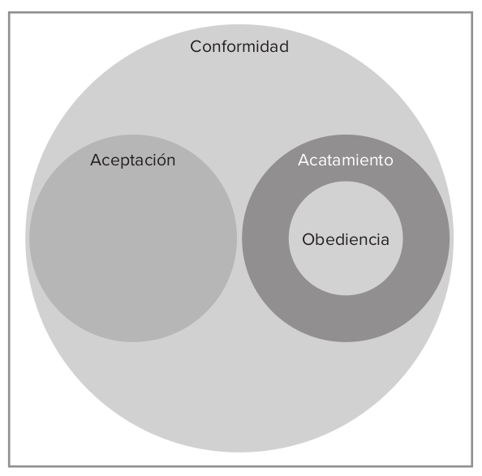
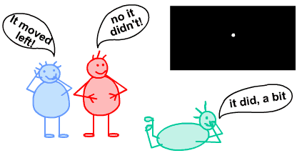
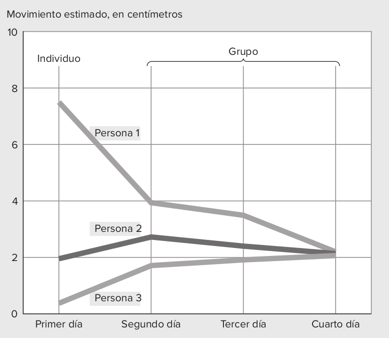
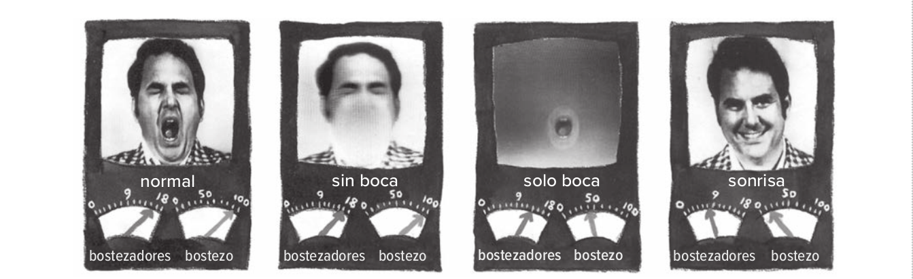

class:center, middle, bg_karl
background-image: url(https://ethicsunwrapped.utexas.edu/wp-content/uploads/2017/02/Obedience-to-Authority-1.jpg)
background-size: 1300px
background-position: 1% 20%

```{r setup, include=FALSE}
options(htmltools.dir.version = FALSE)
knitr::opts_chunk$set(
  fig.width=9, fig.height=3.5, fig.retina=3,
  out.width = "100%",
  cache = FALSE,
  echo = TRUE,
  message = FALSE, 
  warning = FALSE,
  hiline = TRUE
)
```

```{r xaringan-themer, include=FALSE, warning=FALSE}
library(xaringanthemer)
style_duo_accent(
  primary_color = "#1381B0",
  secondary_color = "#085e9f",
  inverse_header_color = "#FFFFFF"
)
```

```{css, echo = F}
.bg_karl {
  position: relative;
  z-index: 1;
}
.bg_karl::before {    
      content: "";
      background-image: url('https://ethicsunwrapped.utexas.edu/wp-content/uploads/2017/02/Obedience-to-Authority-1.jpg');
      background-size: cover;
      position: absolute;
      top: 0px;
      right: 0px;
      bottom: 0px;
      left: 0px;
      opacity: 0.35;
      z-index: -1;
}

.my-style {
  font-weight: bold;
  font-style: normal;
  font-size: 1em;
  color: white;
}
```


# Obediencia y conformidad

<br>
<br>
<br>
<br>
<br>
<br>
<br>

#### .my-style[Francisco Villarroel (CICS- UDD)]
#### .my-style[Curso Psicología Social - Universidad del Desarrollo]


---
background-image: url(3_obediencia_files/logo_psicologia_UDD.png)
background-size: 200px
background-position: 97% 97%

#Objetivo de la clase

- Comprender las diferencias entre conformidad y obediencia
- Analizar cuáles son los expertimentos clásicos sobre conformidad y obediencia
- Analizar los factores predictores de obediencia y conformidad
- Distinguir los factores principales para analizar quienes son los que se conforman u obedecen más
---
class:center, middle, bg_karl
background-image: url(https://img2.rtve.es/imagenes/documentos-rne-juicio-adolf-eichmann-ejecutor-del-holocausto-18-02-22/1645217295119.jpg)
background-size: 1350px
background-position: 1% 20%
class: inverse center middle

# Cuando se cometen atrocidades como el holocausto ¿sólo se siguen órdenes?

<br>
<br>
<br>
<br>
<br>
<br>
<br>
<br>
<br>
<br>
<br>

_Juicio a Adolf Eichmann, Ejecutor del Holocausto (1961)_

---
background-image: url(3_obediencia_files/logo_psicologia_UDD.png)
background-size: 200px
background-position: 97% 97%
class: left, middle

## ¿Qué es la conformidad?

--

.pull-left[

>_"La conformidad es el término general que se refiere a actuar de manera diferente debido a la influencia de otros. La conformidad no es solo actuar como los demás; también es verse afectado por cómo actúan"_

]

.pull-right[

- La conformidad es un cambio de comportamiento para unirse a un "otro"
- En occidente es visto de mala forma, pero en oriente e sun valor más bien positivo.

]


---
background-image: url(3_obediencia_files/logo_psicologia_UDD.png)
background-size: 200px
background-position: 97% 97%
class: left, middle

## Conformidad, aceptación, acatamiento y obediencia

.pull-left[

**Aceptación**: Cuando un grupo lo ha persuadido de algo. Cree de manera sincera que es la acción correcta

**Acatamiento**: El Acatamiento es conformarse con una expectativa o petición sin creer lo que estás haciendo. 

**Obediencia**: Variación del acatamiento. La obediencia es hacer algo que no se haría de otro modo que alguien se lo diga. 


]


.pull-right[

```{r, echo=FALSE, fig.align='center', out.width="80%"}




```


]
---
background-image: url(3_obediencia_files/logo_psicologia_UDD.png)
background-size: 200px
background-position: 97% 97%
class: left, top

# Plan de esta clase

Experimento                 | Fenómeno que estudia         
----------------------------|------------------------------------
Experimento de Sherif       | Formación de normas sociales 
Experimento de Salomon Asch | Presión social en el comportamiento
Experimento de Milgram      | Obediencia a la autoridad


---
class: inverse center middle

## ¿Cómo se forman las normas sociales?

---
background-image: url(3_obediencia_files/logo_psicologia_UDD.png)
background-size: 200px
background-position: 97% 97%
class: left, middle

## Experimento de Sherif 

--

¿Se puede recrear el nacimiento de una norma social en el laboratorio?


--

.pull-left[

```{r, echo=FALSE, fig.align='center'}

```


]

--

.pull-right[

* Se coloca una persona enun cuarto oscuro, sin referencia espacial
* Se lanza una luz a 4.5mts que se mueve erráticamente. Se le pregunta a la persona cuánto se movió la luz
* Primero 15cm, luego 25cm y las posteriore sseñala que son 20cm
* Se integran a dos personas más que dicen números bastante menores (2.5 y 5cm). Con el pasar de los intentos las personas convergen en un número.
* 

]
---
background-image: url(3_obediencia_files/logo_psicologia_UDD.png))
background-size: 200px
background-position: 97% 97%
class: left, middle


.pull-left[

```{r, echo=FALSE, fig.align='center'}

```


]

--

.pull-right[

* Finalmente, la luz **nunca se movió. se usa una ilusión óptica**
* Sheriff quería mostrar la capacidad de sugestión de las personas
* Se les preguntó a las mismas personas un año después y las personas seguían acatando la norma grupal

]

---
background-image: url(3_obediencia_files/logo_psicologia_UDD.png)
background-size: 200px
background-position: 97% 97%
class: left, middle

## Poder de la cultura en la construcción de creencias

.pull-left[

- **Efecto Camaleón**
  1. Mimetismo del comportamiento con el de otra persona
    * Son comportamientos automáticos o involuntarios (ej: bostezo)
    * Nuestro mimetismo natural nos inclina a sentir lo que el otro siente

]

.pull-right[

- **Histeria colectiva**
  1. Caso de convulsiones post-siesta de Katie Krautwurst. Su amiga a la semana después sufrió lo mismo
  1. Hasta 18 mujeres sufrieron este problema. fueron hasta la TV a buscar respuestas
  1. Los trastornos conversivos hacen que uno transmita de manera inconciente el estrés a partir de síntomas físicos, que
  se vuelven contagiosos.

]

**Suicidio y uso de armas de fuego es también socialmente contagioso. Los suicidios por imitación tienen una probabilidad 14 veces mayir cuando son por celebridades. _13 Reasons why_ de Netflix hizo que aumentara un 26% las búsquedas de google de cómo suicidarse.**

---
background-image: url(3_obediencia_files/logo_psicologia_UDD.png)
background-size: 200px
background-position: 97% 97%
class: left, middle

```{r, echo=FALSE, fig.align='center', out.width="120%", fig.cap="Experimento sobre expresiones faciales que vuelven los bostezos más contagiosos. Los ojos son los que más contagian"}



```

---
class: inverse center middle

# El poder de la presión social

---
background-image: url(3_obediencia_files/logo_psicologia_UDD.jpg)
background-size: 200px
background-position: 97% 97%

## **Las actitudes son producto de numerosos procesos de socialización durante nuestras etapas de la vida**

--
1) Premios y castigos que hemos recibido por nuestra conducta

--

2) Por modelado o imitación de otros

--

3) Por refuerzo u observación de las consecuencias de la conducta en otros

--

Sin embargo hay que recordar las categorìas cognitivas, afectivas y conductuales
---
background-image: url(3_obediencia_files/logo_psicologia_UDD.jpg)
background-size: 200px
background-position: 97% 97%

### Cognitiva

#### La sola exposición a distintos estímulos durante a la vida genera pensamientos o creencias sobre objetos de actitud.

#### También se generan actitudes en base a socialización de experiencias de terceros

---
background-image: url(3_obediencia_files/logo_psicologia_UDD.jpg)
background-position: 97% 97%

### Afectiva

#### Condicionamiento clásico

--

**Crear actitudes donde antes no había una formada**

--

#### Priming Afectivo

--

**Similar al anterior, pero primero se presenta el efecto incondicionado y luego el condicionado**

--

- Ej: fotos de amigos + fotos de lo que quiero condicionar (spoiler: ¡No siempre funciona!)

--

#### Mera Exposición

--

**La mera exposición constante a un estímulo, de forma repetitiva, puede generar una actitud positiva a él**

---
background-image: url(3_obediencia_files/logo_psicologia_UDD.jpg)
background-size: 200px
background-position: 97% 97%

### Conductual

#### Condicionamiento clásico

--
Expresiones faciales como señal de ciertas actitudes

--

#### Disonancia cognitiva

--

**Los humanos intentamos actuar acorde a nuestro pensamiento. si no ocurre existe disonancia cognitiva. Luego buscamos comportarnos acorde a lo que creemos**

--

#### Autovalidación

--
**A veces nuestrra propia conducta es por definición una validación para la misma**

--

#### Sesgo de búsqueda

--
**Similar a la disonancia cognitiva, cuando actuamos de cierta forma buscamos (selectivamente) pensamientos acordes con ello**

---
class: inverse center middle

## ¿Actitudes = Comportamiento?

--
### ¡No necesariamente!

---
class: inverse center middle

### Fortaleza de actitudes y su relación con el comportamiento

---
background-image: url(3_obediencia_files/logo_psicologia_UDD.jpg)
background-size: 200px
background-position: 97% 97%

### Criterios objetivos de medición de actitudes

--

##### Extremismo

--

* Cuán intensa es mi actitud y en qué dirección

--

##### Accesibilidad

--

* Rapidez en que una actitud viene a nuestra mente

--

##### Ambivalencia

--

* Un objeto de actitud puede tener dos valores de distinto signo

--

##### Estabilidad

--

* Si esta actitud se mantiene intacta en el tiempo

--

##### Resistencia

--

* Indicador de cuánto te resistes a cambiar de actitud

---
background-image: url(3_obediencia_files/logo_psicologia_UDD.jpg)
background-size: 200px
background-position: 97% 97%

### Criterios subjetivos de metición de actitudes

---
## Relación Actitudes y comportamiento. 

[Tienen que ver básicamente sobre la percepción de los indicadores objetivos]

--

### Accesibilidad

--

* Facilidad con la que experimentan la actitud

--

### Estabilidad

--

* En qué medida considera que su actitud es estable

--

### Resistencia

--

* Cómo cree que su actitud resistiría a un ataque de información contraria a ella.

---
background-image: url(Actitudes_files/Logo-Psicología-UDD.jpg)
background-size: 200px
background-position: 97% 97%

### Considere también:

--

#### Confianza

--

* Sustentada por experiencias pasadas directas; consensos sociales; cuando llegan fácil a la mente; cuando se ha pensado mucho.

#### Importancia

--

* Relevancia que se le da a la propia actitud

--

#### Conocimiento

--

* Cantidad de conocimiento que se tiene sobre la actitud y su objeto de actitud


---
background-image: url(Actitudes_files/Logo-Psicología-UDD.jpg)
background-size: 200px
background-position: 97% 97%

### Formas de medición de actitudes


- Al ser constructos mentales, es difícil medir las actitudes de manera directa y fiable.

--

- Podemos dividirlas en métodos indirectos y directos

---
layout: false
---
background-image: url(Actitudes_files/Logo-Psicología-UDD.jpg)
background-size: 200px
background-position: 97% 97%

## Escalas de diferencias semántico


---
background-image: url(Actitudes_files/Logo-Psicología-UDD.jpg)
background-size: 200px
background-position: 97% 97%

#### Escalas de Likert


---
class: left, middle


---
class: inversed, center, middle
background-image: url(https://user-images.githubusercontent.com/163582/45438104-ea200600-b67b-11e8-80fa-d9f2a99a03b0.png)
background-size: 80px
background-position: 50% 90%

# ¡Gracias!


fvillarroelr@udd.cl

Slide creado con el paquete [**xaringan**](https://github.com/yihui/xaringan).


El  chakra viene de [remark.js](https://remarkjs.com), [**knitr**](https://yihui.org/knitr/), y [R Markdown](https://rmarkdown.rstudio.com).
Este slide fue creado por [**xaringan**](https://github.com/yihui/xaringan) y [**XaringanThemer**](https://pkg.garrickadenbuie.com/xaringanthemer/index.html)
