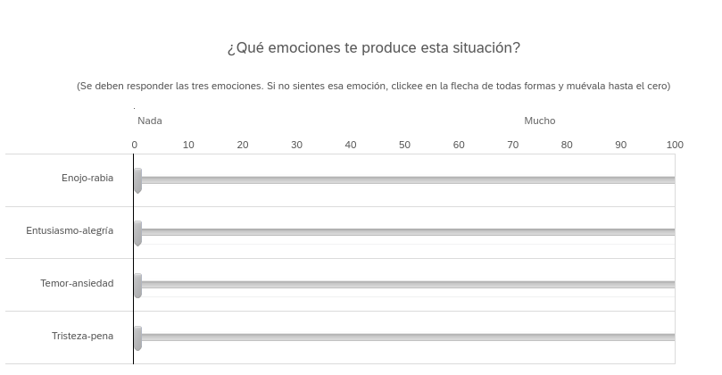

class:center, middle, .bg_karl
background-image: url(http://psychology.iresearchnet.com/wp-content/uploads/2016/01/Attitude-Formation-1.jpg)
background-size: 1350px
background-position: 1% 20%

```{r setup, include=FALSE}
options(htmltools.dir.version = FALSE)
knitr::opts_chunk$set(
  fig.width=9, fig.height=3.5, fig.retina=3,
  out.width = "100%",
  cache = FALSE,
  echo = TRUE,
  message = FALSE, 
  warning = FALSE,
  hiline = TRUE
)
```

```{r xaringan-themer, include=FALSE, warning=FALSE}
library(xaringanthemer)
style_duo_accent(
  primary_color = "#1381B0",
  secondary_color = "#085e9f",
  inverse_header_color = "#FFFFFF"
)
```
```{css, echo = F}
.bg_karl {
  position: relative;
  z-index: 1;
}
.bg_karl::before {    
      content: "";
      background-image: url('http://psychology.iresearchnet.com/wp-content/uploads/2016/01/Attitude-Formation-1.jpg');
      background-size: cover;
      position: absolute;
      top: 0px;
      right: 0px;
      bottom: 0px;
      left: 0px;
      opacity: 0.5;
      z-index: -1;
}
```

## Actitudes: Teoría y formas de medición.
#### Francisco Villarroel (CICS- UDD) 
#### Curso Psicología Social - Universidad del Desarrollo


---
background-image: url(Actitudes_files/Logo-Psicología-UDD.jpg)
background-size: 200px
background-position: 97% 8%

#Objetivo de la clase

- Identificar qué son las actitudes
- Comprender las fuentes de las actitudes
- Distinguir los componentes que hacen que las actitudes sean más fuertes o débiles
- Analizar las formas que tiene la psicología social para medir actitudes

---
class: inverse center middle

# ¿Qué son las actitudes?

--
¿Juicios? ¿Percepciones? ¿prejuicios?

---
background-image: url(Actitudes_files/Logo-Psicología-UDD.jpg)
background-size: 200px
background-position: 97% 8%
class: center, middle

## Hacia una definición de actitud

--


>_Evaluaciones globales y relativamente estables que las personas hacen sobre otras personas, ideas o cosas que, técnicamente, reciben la denominación de objetos de actitud_

---
background-image: url(Actitudes_files/Logo-Psicología-UDD.jpg)
background-size: 200px
background-position: 97% 8%
class: left, middle

## ¿Por qué son importantes las actitudes?

--
####Relevantes para adquirir nuevos conocimientos

--
####Buscan información del entorno con uno mismo 

--
####Se relacionan directamente con el comportamiento/Conducta

--
####Permite conectar el medio social con el comportamiento individual

--
####Cambios de actitudes pueden cambiar contextos más complejos

--
####Permite Conectar áreas de investigación dispersas


---
class: inverse center middle

## Las actitudes son un fenómeno mental

--
### ¡No son directamente observables!

---
background-image: url(Actitudes_files/Logo-Psicología-UDD.jpg)
background-size: 200px
background-position: 97% 8%
class: left, middle

## Dimensiones y funciones de las actitudes

--

.pull-left[
#### Componentes de actitudes

*   Componente cognitivo
*   Componente afectivo
*   Componente conductual
]

--

.pull-right[

#### Ejemplos:

* "Adidas es técnicamente mejor a Nike"
* "Goce que disfruto tomándome un café de strabucks"
* "Siempre que puedo recomiendo a mi tatuador"

]

---
background-image: url(Actitudes_files/Logo-Psicología-UDD.jpg)
background-size: 200px
background-position: 97% 8%
class: left, middle

# Funciones de la actitudes

- **Organización de conocimiento**
  1. Ya que existe sobre carga informativa:
    - Actitudes ayudan a _necesidad básica de conocimiento y control_
    - Actitudes organizan info en términos positivos y negativos
    - Actitudes ayudan a predecir características de esa nueva información
    - Actitudes guían a información relevante (_¿Peligro de sesgos?_)
  2. Actitudes guìan _búsqueda de equilibrio y coherencia_

- **Función Instrumental o utilitaria**
  1. Actitudes llevan a cumplir objetivos y evitar los no deseados
  1. Se optimizan relaciones con el entorno.

- **Función de identidad y expresión de valores**
  1. Sirven para informar al entorno (y a uno mismo) quienes somos.
  2. Hay un fortalecimiento de identidad (individuales y grupales)
  3. Sirve para relacionarse con gente socialmente similar (homofilia)
  4. Satisface _la neesidad básica de aceptación y pertenencia grupal_
  
---
layout: true

### Fuentes de construcción de actitudes
---
background-image: url(Actitudes_files/Logo-Psicología-UDD.jpg)
background-size: 200px
background-position: 97% 8%

 #### **Las actitudes son producto de numerosos procesos de socialización durante nuestras etapas de la vida**

--
1) Premios y castigos que hemos recibido por nuestra conducta

--

2) Por modelado o imitación de otros

--

3) Por refuerzo u observación de las consecuencias de la conducta en otros

--

Sin embargo hay que recordar las categorìas cognitivas, afectivas y conductuales
---
background-image: url(Actitudes_files/Logo-Psicología-UDD.jpg)
background-size: 200px
background-position: 97% 8%

### Cognitiva

#### La sola exposición a distintos estímulos durante a la vida genera pensamientos o creencias sobre objetos de actitud.

### También se generan actitudes en base a socialización de experiencias de terceros

---
background-image: url(Actitudes_files/Logo-Psicología-UDD.jpg)
background-size: 200px
background-position: 97% 8%

### Afectiva

#### Condicionamiento clásico

#### Priming Afectivo

#### Mera Exposición

---
background-image: url(Actitudes_files/Logo-Psicología-UDD.jpg)
background-size: 200px
background-position: 97% 8%

### Conductual

#### Condicionamiento clásico

#### Disonancia cognitiva

#### Autopercepción

#### Sesgo de búsqueda

---
layout: true

### Fortaleza de actitudes y su relación con el comportamiento

---
background-image: url(Actitudes_files/Logo-Psicología-UDD.jpg)
background-size: 200px
background-position: 97% 8%

#### Criterios objetivos de metición de actitudes

--

##### Extremismo

--

* Cuán intensa es mi actitud y en qué dirección

--

##### Accesibilidad

--

* Rapidez en que una actitud viene a nuestra mente

--

##### Ambivalencia

--

* Un objeto de actitud puede tener dos valores de distinto signo

--

##### Estabilidad

--

* Si esta actitud se mantiene intacta en el tiempo

--

##### Resistencia

--

* Indicador de cuánto te resistes a cambiar de actitud

---
background-image: url(Actitudes_files/Logo-Psicología-UDD.jpg)
background-size: 200px
background-position: 97% 8%

### Criterios subjetivos de metición de actitudes

---
## Relación Actitudes y comportamiento. 

[Tienen que ver básicamente sobre la percepción de los indicadores objetivos]

--

### Accesibilidad

--

* Facilidad con la que experimentan la actitud

--

### Estabilidad

--

* En qué medida considera que su actitud es estable

--

### Resistencia

--

* Cómo cree que su actitud resistiría a un ataque de información contraria a ella.

---
background-image: url(Actitudes_files/Logo-Psicología-UDD.jpg)
background-size: 200px
background-position: 97% 8%

### Considere también:

--

#### Confianza

--

* Sustentada por experiencias pasadas directas; consensos sociales; cuando llegan fácil a la mente; cuando se ha pensado mucho.

#### Importancia

--

* Relevancia que se le da a la propia actitud

--

#### Conocimiento

--

* Cantidad de conocimiento que se tiene sobre la acittud y su objeto de actitud


---
class: inverse center middle

## ¿Actitudes = Comportamiento?

--
### ¡No necesariamente!


---
background-image: url(Actitudes_files/Logo-Psicología-UDD.jpg)
background-size: 200px
background-position: 97% 8%

### Formas de medición de actitudes


- Al ser constructos mentales, es difícil medir las actitudes de manera directa y fiable.

- Podemos dividirlas en métodos indirectos y directos
---
layout: false
---
background-image: url(Actitudes_files/Logo-Psicología-UDD.jpg)
background-size: 200px
background-position: 97% 8%

## Escalas de diferencias semántico


---
background-image: url(Actitudes_files/Logo-Psicología-UDD.jpg)
background-size: 200px
background-position: 97% 8%

#### Escalas de Likert


---
class: left, middle




---
class: inversed, center, middle
background-image: url(https://user-images.githubusercontent.com/163582/45438104-ea200600-b67b-11e8-80fa-d9f2a99a03b0.png)
background-size: 80px
background-position: 50% 90%

# ¡Gracias!


fvillarroelr@udd.cl

Slide creado con el paquete [**xaringan**](https://github.com/yihui/xaringan).


El  chakra viene de [remark.js](https://remarkjs.com), [**knitr**](https://yihui.org/knitr/), y [R Markdown](https://rmarkdown.rstudio.com).
Este slide fue creado por [**xaringan**](https://github.com/yihui/xaringan) y [**XaringanThemer**](https://pkg.garrickadenbuie.com/xaringanthemer/index.html)


